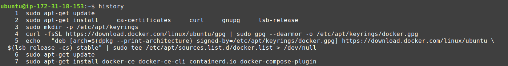
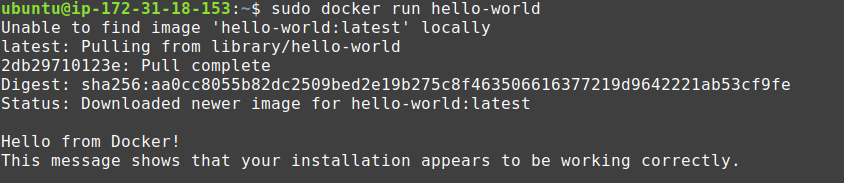
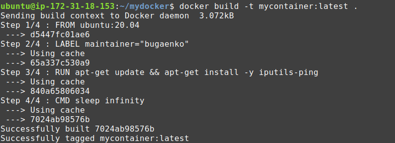
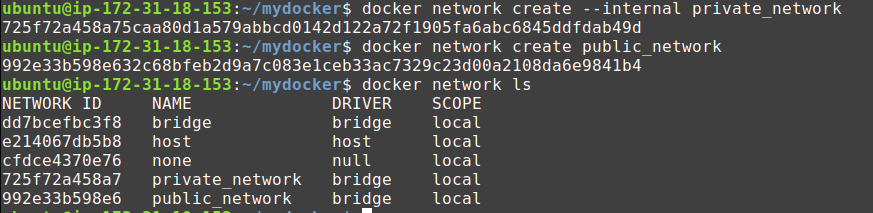
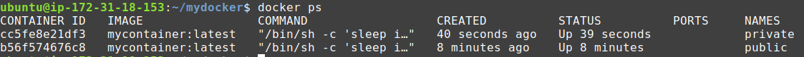
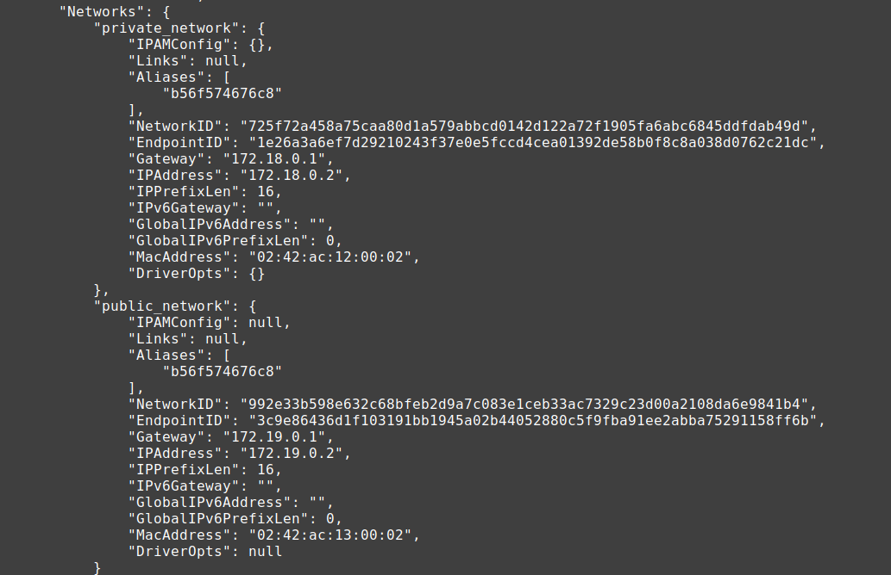
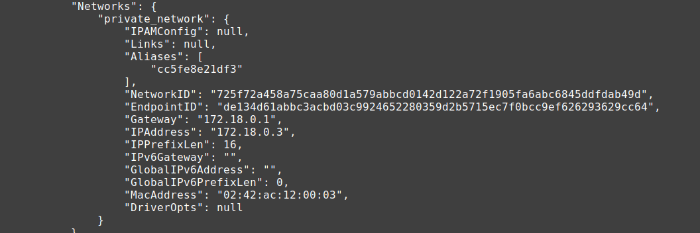
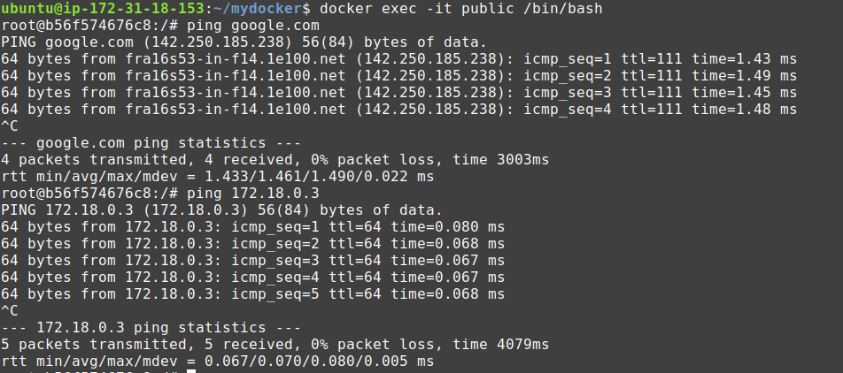
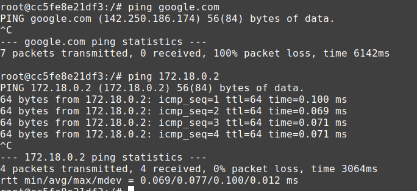

# Docker Homework

### Task 1

1. Install docker
2. Prepare a dockerfile based on Apache or Nginx image
3. Added your own index.html page with your name and surname to the docker image
4. Run the docker container at port 8080
5. Open page in Web Browser
6. Report save in GitHub repository

To accomplish this task, I've brought up a virtual machine on AWS with ubuntu 20.04.
In the next step I installed docker on virtual machine. To do this, I used the following commands:

1. Update the apt package index and install packages to allow apt to use a repository over HTTPS:

~~~
sudo apt-get update
sudo apt-get install \
    ca-certificates \
    curl \
    gnupg \
    lsb-release
~~~

2. Add Docker’s official GPG key:

~~~
sudo mkdir -p /etc/apt/keyrings
curl -fsSL https://download.docker.com/linux/ubuntu/gpg | sudo gpg --dearmor -o /etc/apt/keyrings/docker.gpg
~~~

3. Set up the repository:

~~~
echo \
  "deb [arch=$(dpkg --print-architecture) signed-by=/etc/apt/keyrings/docker.gpg] https://download.docker.com/linux/ubuntu \
  $(lsb_release -cs) stable" | sudo tee /etc/apt/sources.list.d/docker.list > /dev/null
~~~

4. Update the apt package index:

~~~
sudo apt-get update
~~~

5. Install Docker Engine, containerd, and Docker Compose.

~~~
sudo apt-get install docker-ce docker-ce-cli containerd.io docker-compose-plugin
~~~

To test the success of the Docker installation, I ran the command:

~~~
sudo docker run hello-world
~~~

In order to use Docker without sudo, I ran the following commands:

1. Create the docker group.

~~~
sudo groupadd docker
~~~

2. Add your user to the docker group.

~~~
sudo usermod -aG docker $USER
~~~
And then I restarted a virtual machine.

After that I created folder in which created 2 files index.html and Dockerfile. In index.html file I added simple html code with my name and surname. In Dockerfile I added instructions with adding index.html file to nginx image.

Then I ran the following command to build my own image with name myfile and version latest:

~~~
docker build -t myfile:latest .
~~~

To run my image I ran the following command:

~~~
docker run -d -p 8080:80 myfile:latest
~~~

After run this command I went to browser and wrote next address 3.72.0.41:8080. The page with my name and surname opened in the tab.

The index.html and [Dockerfile files are available at the following link](https://github.com/bugaenkoyu/Docker/tree/main/task1).

### Task 2

1. Prepare private and public network
2. Prepare one dockerfile based on ubuntu with the ping command
3. One container must have access to the private and public networks the second container
must be in the private network
4. A ) Run a container that has access to the public network and ping some resources (
example: google.com )
B ) The second container ping the first container via a private network
5. Report save in GitHub repository

In the beginning, I created a Dockerfile that installs iputils-ping on ubuntu 20.04 and executes the sleep infinity command. Then I built image with name mycontainer:latest.

The next step it is creating public and private network.
To do this, I used the following commands:

~~~
docker network create --internal private_network
docker network create public_network
~~~

Then I started the container with the public network settings and added it to the private network with the following command.

~~~
docker run -d --name public --network public_network mycontainer:latest
docker network connect private_network public
~~~

Another container I added only to the private network.

~~~
docker run -d --name private --network private_network mycontainer:latest
~~~

On the next picture we can see two running containers with names: private and public.

After inspecting the network interfaces of our containers, it can be seen that public is connected to two networks, and private to one, respectively.

In order to access the created containers, use the command:

~~~
docker exec -it public /bin/bash
~~~

As you can see from the picture, we can easily ping both the Internet site and another container by IP from the container located in the public and private network.

~~~
docker exec -it private /bin/bash
~~~

From a container located in a private network, we can ping only another container. This is shown in the picture below.

The [Dockerfile files for task2 are available at the following link](https://github.com/bugaenkoyu/Docker/tree/main/task2).